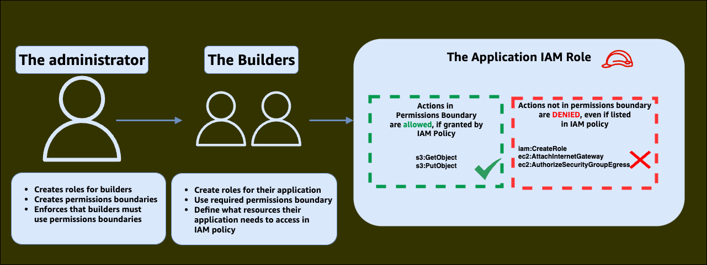

# Example Permissions Boundaries

This repository contains a sample IAM permissions boundary as a starting point for creating your own permissions boundary to meet the security needs of your organization. The IAM permissions boundary sample, when attached to an IAM role, allow it to perform all expected workload tasks without being able to modify the security of its environment.

The permissions boundary policy sample is just an example, and may allow for more access than you intend your application roles to have. You should remove any unnecessary permissions for your applications in the spirit of least-privileged access.

## About Permissions Boundaries

Permissions boundaries are additional IAM policies that can be attached to IAM principals (users and roles), and limit the maximum entitlements of the entity. IAM permissions boundaries can only deny entitlements with either an implicit (entitlement is not present in the permissions boundary) or explicit (there is a deny statement in the permissions boundary) deny, and cannot be used to grant an entitlement. 

Permissions boundaries are an IAM policy defined in the just same way as other IAM policies, however when used as a permission boundary the policy will apply constraints to the principal to which they are attached.

To learn more about permissions boundaries, refer to the AWS documentation link below.



## The use case for Permissions Boundaries

Organizations would like to empower their builders to take self service actions in AWS to build with more speed and agility. However, granting the ability to create and modify IAM roles and policies may lead to a builder gaining more privilege for themselves or their applications beyond what was originally intended.

For example when a builder wishes to deploy a Lambda function, a corresponding IAM role is required to be defined as the Lambda function’s execution role. Permissions boundaries provide a safe and scalable mechanism for an organization to delegate IAM self service actions to their builders, and to help ensure that the created IAM roles adhere to their defined security requirements.

Permissions boundaries are the IAM feature to provide builders self-service access to create, modify, and update IAM principals and policies without elevating their privilege beyond what is defined in the permission boundary.

## Permissions Boundaries Best Practices


#### Do not put resources in permissions boundaries policies

Permissions boundaries are best for coarse grained access control, limiting what IAM actions can be performed by the IAM role they’re attached to. Least privileged access to specific AWS resources, such as S3 buckets of KMS keys should be managed in resource or IAM policy. Having a wildcard (“*”) in the resource element of a permissions boundary policy does not grant access to all resources, or any resource. This only allows permissions to be granted by other policy types that are capable of granting access (IAM, and resource policies).

#### Only use allow statements in permissions boundaries

Use only allow statements in your permissions boundary policies. Any IAM action that is not in the allow statements of your permissions boundary will be implicitly denied, and you can deny many more actions using the allow plus implicit deny approach rather than explicitly denying actions while granting access to others in the permissions boundary.

#### Avoid using conditions in permissions boundaries

Access conditions, such as those based on source IP address, or Virtual Private Cloud (VPC) ID of the request are best placed in other policy types. If you have a common set of access you want to allow, or deny based on a condition across multiple IAM roles, we recommend using Service Control Policy or Resource Policy to apply that restriction.

#### Avoid using a unique permissions boundary per IAM role

Permissions boundaries are ideally reusable across many roles within an AWS account. Managing a unique permissions boundary per IAM Role makes permissions boundary enforcement challenging to scale with service control policy, and introduces additional IAM complexity without a clear benefit. 

If you want to limit the maximum permissions further than just using one permissions boundary, you may consider creating multiple permissions boundary policies that align with different types of applications you may run and have your builders choose the one that is best suited for their application. An example of this would be different permissions boundaries for the different tiers of a 3 tier webapp, and the permissions boundary associated with the IAM role of the EC2 instances of the front end/presentation tier do not allow access to data services, but do allow operational utilities like cloudwatch logging and systems manager. The backend permissions boundary would allow for the possibility of access to be granted to data storage services, such as RDS or S3.


## Using Permissions Boundaries

Typically a permissions boundary policy contains actions that an created role may perform, like s3:GetObject, but not operations that would allow a role to modify the security of its own environment such as ec2:AuthorizeSecurityGroupEgress. 

When using permissions boundaries, it is helpful to think in terms of three IAM principals, or personas:

- The administrator or cloud operator, who defines the permissions boundary policies and the policies attached to builder principals.
- The builder, who will be creating subsequent principals for their applications to use. The builder is required to attach permissions boundary policies to all principals that they create.
- The application, which uses the principals created by the above builder. The application principals have the permissions boundary policy attached by the builder.

To summarise:

- The administrator persona defines a permissions boundary policy
- The builder persona is required to attach the permissions boundary policy to application principals they create
- The application persona is restricted by the contents of the permissions boundary policy

The following sections will refer to these personas for simplicity.

### Ensuring the permissions boundary policies are used

IAM permissions boundaries, created by the administrator persona, can be enforced during the creation and modification of IAM roles by using IAM conditions. 

For example, the following IAM policy, when attached to our builder persona, ensures that the builder is able to create, modify, and update roles, *but only* when a specified permissions boundary policy is attached to the new role.


```json
{
  "Version": "2012-10-17",
  "Statement": [
    {
      "Sid": "EnforceActionsHaveBoundary",
      "Effect": "Deny",
      "Action": [
        "iam:AttachRolePolicy",
        "iam:CreateRole",
        "iam:DetachRolePolicy",
        "iam:PutRolePolicy",
        "iam:DeleteRolePolicy",
        "iam:PutRolePermissionsBoundary"
      ],
      "Resource": "*",
      "Condition": {
        "StringNotLike": {
          "iam:PermissionsBoundary": "arn:aws:iam::*:policy/permissionboundarypolicy"
        }
      }
    },
    {
      "Sid": "DenyChangesToBoundaryPolicy",
      "Effect": "Deny",
      "Action": [
        "iam:DeletePolicy",
        "iam:CreatePolicyVersion",
        "iam:CreatePolicy",
        "iam:DeletePolicyVersion",
        "iam:SetDefaultPolicyVersion"
      ],
      "Resource": "arn:aws:iam::*:policy/permissionboundarypolicy"
    }
  ]
}
```

By attaching this policy to the builder persona, the builder will be required to attach `arn:aws:iam::*:policy/permissionboundarypolicy` whenever they create roles or specify policies to attach to a role for use by their application. The builder will also be unable to make changes to `arn:aws:iam::*:policy/permissionboundarypolicy`, the permissions boundary policy itself.

Wildcarding the account number with '*' in the "Resource" element of an IAM policy is safe for actions in the "iam:" namespace, as IAM resources can only ever be modified within the same AWS account. This means the above policy examples can be used without updating the ARNs for a specific account ID. Wildcarding account numbers in other namespaces/resources may grant entitlement to resources in other AWS accounts if they are configured for cross account access.

### Using IAM paths to constrain access

As a best practice, roles used by builders to take actions in self service should only be entitled to create or modify IAM resources with specific IAM paths as a means of ensuring they do not modify resources that are not used by their workloads, such as those belonging to security or infrastructure teams. The following allow statements only permit for builders to create/modify policies in the 'applicationpolicies' path, create/modify/pass roles in the 'applicationroles' path, and create/modify instance profiles in the applicationinstanceprofiles path.

```json
{
  "Version": "2012-10-17",
  "Statement": [
    {
      "Sid": "OnlyPoliciesInTheirPath",
      "Effect": "Allow",
      "Action": [
        "iam:CreatePolicy",
        "iam:CreatePolicyVersion",
        "iam:DeletePolicy",
        "iam:SetDefaultPolicyVersion"
      ],
      "Resource": "arn:aws:iam::*:policy/applicationpolicies/*"
    },
    {
      "Sid": "AllowRolesOnlyInPath",
      "Effect": "Allow",
      "Action": [
        "iam:AttachRolePolicy",
        "iam:CreateRole",
        "iam:DetachRolePolicy",
        "iam:PutRolePolicy",
        "iam:DeleteRolePolicy",
        "iam:PutRolePermissionsBoundary",
        "iam:PassRole"
      ],
      "Resource": "arn:aws:iam::*:role/applicationroles/*"
    },
    {
      "Effect": "Allow",
      "Action": [
        "iam:CreateInstanceProfile",
        "iam:AddRoleToInstanceProfile",
        "iam:RemoveRoleFromInstanceProfile",
        "iam:DeleteInstanceProfile"
      ],
      "Resource": [
        "arn:aws:iam::*:role/applicationroles/*",
        "arn:aws:iam::*:instance-profile/applicationinstanceprofiles/*"
      ]
    }
  ]
}
```

More information about IAM paths can be found in the the AWS documentation link below.

### Policy summary

Using the two above example policies, attached to our builder personas, ensure that builders:

- Are always required to use predefined permissions boundary policies when creating or modifying IAM roles used by an application
- Are only able to modify IAM resources in specific paths 

The combination of these two achieves our goal of safely delegating IAM tasks to builders in an AWS account.

## This Repository

This repository contains two sample policies and an AWS CloudFormation template to deploy each:

1. VerbosePermissionsBoundary . This example contains a full list of actions with no wildcards present, and the policy is separated out into different statements based on the different usecases
2. MinifiedPermissionsBoundary . This example has all the same entitlements, however wildcarding has been liberally applied and all the statements are condensed into one, optimizing for character space.

The raw IAM policy documents can be found in the policies/ folder in their respectively named .json file

An AWS CloudFormation template for each policy can be found in the /cloudformation folder in a their respectively named .json file . The AWS CloudFormation template will create policies named "VerbosePermissionsBoundary" and "MinifiedPermissionsBoundary".
## Documentation Links

https://docs.aws.amazon.com/IAM/latest/UserGuide/access_policies_boundaries.html

https://docs.aws.amazon.com/IAM/latest/UserGuide/reference_identifiers.html#identifiers-arns
